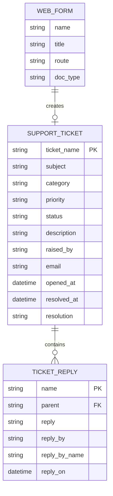
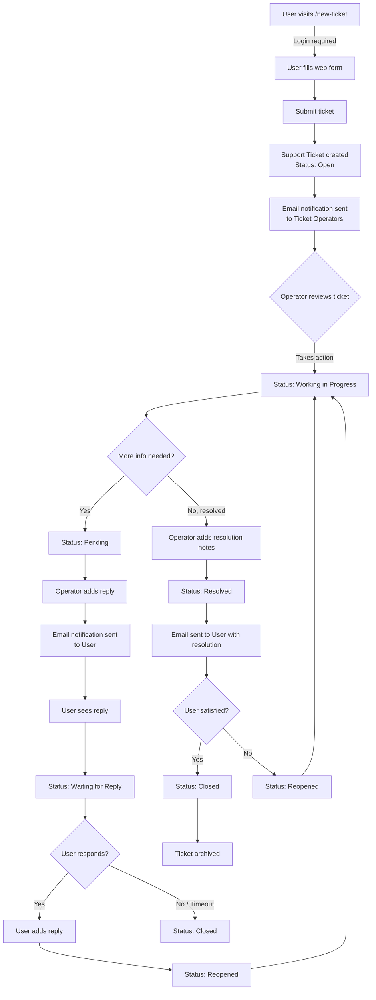

# Prime Ticket

Internal support ticketing app for Frappe/ERPNext.

Users submit tickets through a login-required web form, operators work them
through a status workflow, and email notifications keep both sides informed.

## Features

- **Support Ticket** DocType (`TICK-00001` naming) with category, priority,
  attachments, a replies thread, and resolution notes
- **Status workflow:** Open / Working in Progress / Pending / Waiting for
  Reply / Resolved / Reopened / Closed
- **Web form** at `/new-ticket` (login required) — users also get a list of
  their own past tickets
- **Roles:** `Ticket Operator` (sees and works all tickets) and `Ticket User`
  (sees only their own) — created automatically on install
- **Email notifications** (shipped as fixtures):
  - New ticket -> all Ticket Operators
  - Status -> Resolved -> email to the ticket raiser
  - Status -> Waiting for Reply -> email to the ticket raiser
  - Status -> Reopened -> all Ticket Operators
- Color-coded list view by status

## Install

On your bench (Frappe v15/v16):

```bash
cd ~/frappe-bench
bench get-app https://github.com/Steeif/prime_ticket
bench --site your-erp-domain.com install-app prime_ticket
bench --site your-erp-domain.com migrate
```

To update later:

```bash
bench update --app prime_ticket
# or: cd apps/prime_ticket && git pull && cd ../.. && bench --site your-erp-domain.com migrate
```

## Post-install setup

1. **Assign roles** (User list -> select user -> Roles):
   - Support staff -> add **Ticket Operator**
   - Regular users -> add **Ticket User** (they keep their normal roles too)
2. Make sure **email is configured** on the site (Email Account / outgoing
   SMTP), otherwise notifications queue but never send.
3. Share the form link: `https://your-erp-domain.com/new-ticket`

## DocType Structure

This app is built around a simple parent-child structure:



### Ticket lifecycle



## Uninstall

```bash
bench --site your-erp-domain.com remove-app prime_ticket
```

Warning: this drops the `tabSupport Ticket` and `tabTicket Reply` tables and
all ticket data with them. Export first if you need the history.

## License

MIT
