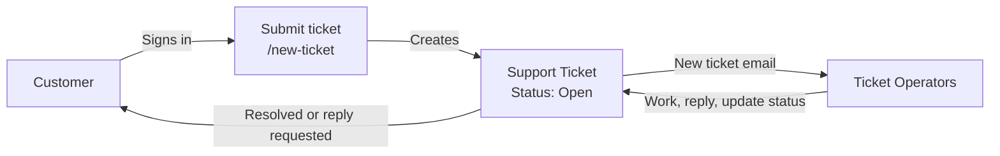
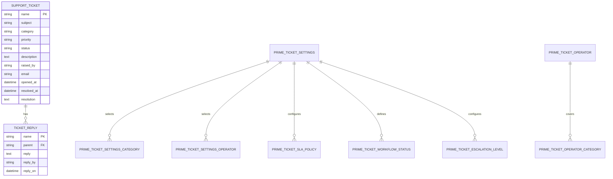
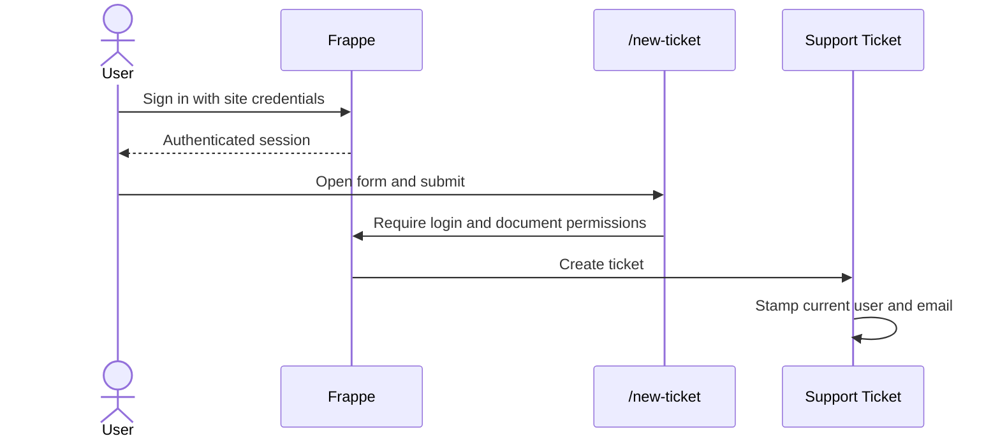

# Prime Ticket


**A straightforward support-ticket app for Frappe and ERPNext.** Customers submit tickets from a sign-in protected web form; support operators triage requests, reply, and keep customers informed with email notifications.

**Current app version: 1.2.0**

[Install](#install) · [How it works](#how-it-works) · [Access and authentication](#access-and-authentication) · [First-time setup](#first-time-setup)

## At a glance

| For customers | For support operators |
| --- | --- |
| Submit a ticket at `/new-ticket` | View and update all tickets in Desk |
| See tickets they have permission to access | Reply, change status, and add resolution notes |
| Receive email when a ticket is resolved or needs a reply | Receive email when tickets are created or reopened |

Tickets use the `TICK-00001` naming format. Each ticket records its category, priority, status, description, raiser, replies, and optional resolution notes.

## How it works



### Ticket statuses

The Support Ticket DocType offers these status values. They are selectable values; the app does not enforce a state-transition workflow.

| Status | Typical use |
| --- | --- |
| Open | Newly submitted ticket |
| Working in Progress | Operator is investigating |
| Pending | Work is temporarily on hold |
| Waiting for Reply | The customer needs to provide more information; sends a customer email |
| Reopened | A resolved ticket needs more work; notifies operators |
| Resolved | Operator has recorded a resolution; sends a customer email |
| Closed | Work is complete |

The list view color-codes tickets by status. The workspace includes a **Submit a Ticket** shortcut to the customer web form, plus **New Ticket**, **All Tickets**, **Open Tickets**, **Waiting for Reply**, and **Reopened Tickets**. Filtered ticket lists show live counts.

### Data model



The settings, SLA, workflow status, escalation, reply, and category-assignment rows are child tables. They are edited through their parent forms rather than opened as standalone workspace items.

## Install

Prime Ticket supports Frappe/ERPNext v15 and v16. From your bench directory:

```bash
bench get-app https://github.com/Steeif/prime_ticket
bench --site your-site.example install-app prime_ticket
bench --site your-site.example migrate
```

The migration command syncs DocTypes and runs the app's metadata repair patch on existing sites.

## First-time setup

1. In **Users**, assign **Ticket Operator** to support staff and **Ticket User** to customers. Users may keep their other roles.
2. Configure an outgoing email account in Frappe so ticket notifications can be delivered.
3. Share `https://your-site.example/new-ticket` with users who should submit tickets.

The app creates both roles automatically during installation and migration. It also creates these notifications idempotently:

| Event | Recipient |
| --- | --- |
| New ticket | Ticket Operators |
| Status changes to Resolved | Ticket raiser |
| Status changes to Waiting for Reply | Ticket raiser |
| Status changes to Reopened | Ticket Operators |

## Access and authentication

Prime Ticket uses Frappe's login, session, roles, and DocType permissions. It does not provide a separate login service.



- The `new-ticket` Web Form requires login and applies document permissions. Frappe handles credentials and the authenticated session; Prime Ticket does not receive or store the user's password.
- System Managers and Ticket Operators can access all Support Tickets. Ticket Users can create tickets and access tickets they own.
- `SupportTicket.validate()` fills `raised_by` from `frappe.session.user` and looks up the user's email. Reply author and timestamp are stamped from the current session as well.
- `Prime Ticket Settings.api_token` is a Password-type field displayed when `enable_api` is enabled. No Prime Ticket endpoint reads or validates it, so enabling that setting does not enable API authentication. For integrations, use Frappe's configured API authentication and the permissions of the associated Frappe user.

## Workspace

The **Prime Ticket** workspace provides four standalone DocType entries:

- Support Ticket
- Prime Ticket Category
- Prime Ticket Operator
- Prime Ticket Settings

Ticket shortcuts and configuration links are grouped into separate workspace cards. Child tables are available from their parent forms, not listed as standalone links.

The **Settings Guide** workspace shortcut opens the in-app documentation at `/prime-ticket-settings-guide`; read it in Arabic at `/prime-ticket-settings-guide-ar`. The English source is [prime-ticket-settings.md](prime_ticket/docs/prime-ticket-settings.md), and the Arabic source is [prime-ticket-settings-ar.md](prime_ticket/docs/prime-ticket-settings-ar.md). The configured Application Logo is shown on both guide pages and the Submit a Ticket web form.

## Update

Run these commands on the server to update Prime Ticket and sync the site:

```bash
cd ~/frappe-bench/apps/prime_ticket
git pull
cd ~/frappe-bench
bench --site frappe.com migrate
bench --site frappe.com clear-cache
```

## Uninstall

```bash
bench --site your-site.example remove-app prime_ticket
```

Back up the site before uninstalling. Removing an app can remove its DocTypes and their stored data.

## License

MIT. See [license.txt](license.txt).

